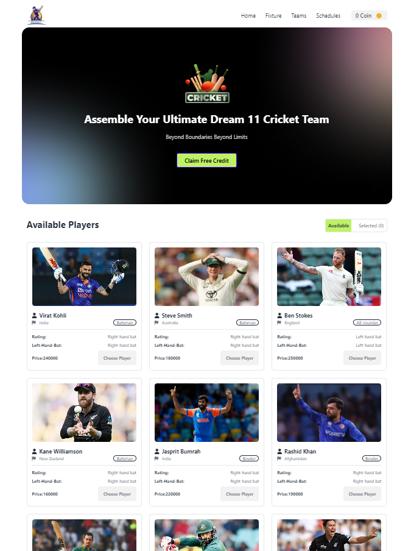

# BPL-DREAM 11

Welcome to **BPL-DREAM 11**! This project is an interactive platform for creating and managing your dream cricket team for the BPL tournament. It provides a user-friendly interface for selecting players, managing budgets, and enjoying a seamless team-building experience.

---

## Live Demo

## Check out the live version of the project: [BPL-DREAM 11](https://bpl-dreams.netlify.app/)

## 🚀 Features

1. **Player Selection**:
   - Add players to your team with a simple click.
   - View available and selected players separately.
2. **Budget Management**:
   - Keep track of your spending and available balance dynamically.
   - Notifications for exceeding budget or balance constraints.
3. **Interactive Notifications**:
   - Real-time success or error messages powered by React Toastify.

---

## 🛠️ Technologies Used

This project leverages modern web technologies for an optimized user experience:

- **React JS**: For building the dynamic user interface.
- **Tailwind CSS**: For utility-first and responsive styling.
- **Daisy UI**: To enhance the design with pre-styled components.
- **React Toastify**: For elegant toast notifications.

---

## 📸 Screenshots



---

## 📦 Installation

To get started with this project, follow these steps:

1. Clone the repository:

   ```bash
   git clone https://github.com/your-username/bpl-dream11.git
   ```

2. Navigate to the project directory:

   ```bash
   cd bpl-dream11
   ```

3. Install dependencies:

   ```bash
   npm install
   ```

4. Start the development server:

   ```bash
   npm start
   ```

5. Open your browser and visit:
   ```
   http://localhost:3000
   ```

---

## 📂 Project Structure

```
BPL-DREAM 11
├── src
│   ├── components
│   │   ├── AvailablePlayers
│   │   ├── SelectedPlayers
│   │   ├── Navbar
│   │   ├── Footer
│   │   └── Banner
│   ├── App.js
│   └── index.js
├── public
├── package.json
└── README.md
```

---

## 🤝 Contributing

Contributions are always welcome! If you want to improve this project:

1. Fork the repository.
2. Create a new branch (`git checkout -b feature-branch`).
3. Commit your changes (`git commit -m 'Add a new feature'`).
4. Push to the branch (`git push origin feature-branch`).
5. Open a Pull Request.

---

Thank you for checking out **BPL-DREAM 11**! 🎉
